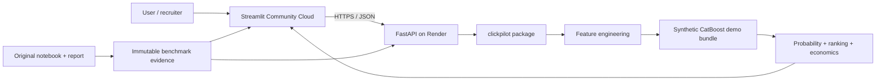

# ClickPilot AI

> **Turn click probability into better ad-ranking and value-aware campaign decisions.**

[](https://clickpilot-ai-mohit.streamlit.app/)
[](https://clickpilot-api.onrender.com/docs)
[](.github/workflows/ci.yml)
[](https://www.python.org/)
[](MODEL_CARD.md)
[](LICENSE)

**Live application:** https://clickpilot-ai-mohit.streamlit.app/  
**FastAPI service:** https://clickpilot-api.onrender.com  
**Interactive API docs:** https://clickpilot-api.onrender.com/docs

**ClickPilot AI** is an end-to-end CTR intelligence platform built from an ad-click prediction case study. It combines leakage-aware temporal validation, CatBoost personalization, batch scoring, decision economics, monitoring, a publicly deployed Streamlit frontend, and a separately deployed Dockerized FastAPI backend.

The original case-study evidence and the public demo model are deliberately separated. The validated metrics below come from the supplied challenge data; the public application uses a deterministic synthetic CatBoost model so the source challenge rows are not redistributed.

## Release status

**Public functional acceptance is complete.** The deployed application has been exercised successfully across all four user-facing workflows:

- single-impression scoring,
- 50-row batch ranking plus ranked CSV export,
- predictive baseline-versus-proposed scenario comparison,
- 1,000-row labeled synthetic monitoring evaluation.

See [Public Release Acceptance](docs/RELEASE_ACCEPTANCE.md) for the evidence record. Synthetic acceptance metrics are kept separate from the original case-study holdout metrics below.

## Why this project is different

Most CTR projects end at a notebook and an AUC score. ClickPilot AI adds the product and ML-engineering layers needed to make a ranking model inspectable and usable:

- score a single ad opportunity,
- rank a batch by click probability,
- convert probability into expected business value using value-per-click and CPM,
- compare baseline vs proposed targeting/placement scenarios,
- expose predictions through a public FastAPI service,
- evaluate labeled post-deployment batches,
- keep original benchmark claims traceable to the case-study notebook/PDF,
- package tests, Docker, CI, monitoring, model-card, security, and responsible-use guidance.

## Validated original case-study result

| Model | ROC-AUC | PR-AUC | Precision | Recall | F1 |
|---|---:|---:|---:|---:|---:|
| Logistic Regression | 0.525902 | 0.065134 | 0.06605 | 0.64463 | 0.11982 |
| LightGBM | 0.543092 | 0.068699 | 0.06842 | 0.60759 | 0.12299 |
| **CatBoost + personalization** | **0.579538** | **0.078022** | **0.07810** | **0.48534** | **0.13455** |

Training data: **463,291 impressions**, **31,331 clicks**, **6.76% CTR**.  
Test data: **128,858 unlabeled impressions**.  
Validation: **train July 2-5 → tune/threshold July 6 → untouched temporal holdout July 7**.

Relative to the Logistic Regression baseline, the selected CatBoost model improved ROC-AUC by about **10.2%** and PR-AUC by about **19.8%**. The absolute metrics remain modest, which is a real limitation and a reason to monitor the system continuously rather than overstate model certainty.

## Personalization evidence

| Feature set | ROC-AUC | PR-AUC |
|---|---:|---:|
| Base | 0.550399 | 0.072366 |
| + user_id | 0.587187 | 0.080151 |
| + user_product | 0.592973 | 0.080994 |
| **+ all interactions** | **0.596135** | **0.081681** |

The largest gain comes from user-level information, with additional lift from user-product and campaign-placement interactions. This is a **ranking-quality** result, not a causal claim that changing a feature creates the modeled CTR increase.

## Product capabilities

### 1. Impression scorer

Enter an ad opportunity and receive predicted click probability, propensity band, lift versus the synthetic demo baseline, expected value per impression / per 1,000 impressions, a value-positive serve recommendation, and unseen-category warnings.

### 2. Batch ranking

Upload a CSV, audit schema/date quality, score every row, rank opportunities, inspect expected CTR, and download the ranked output. If the batch also contains `is_click`, ClickPilot computes live monitoring metrics including ROC-AUC, PR-AUC, Brier score, log loss, precision, recall, and F1.

### 3. Decision simulator

Compare a baseline and proposed ad-delivery configuration through the same model and estimate probability-point change, relative probability change, incremental expected clicks for a chosen volume, and incremental expected value under value-per-click and CPM assumptions. The simulator is explicitly labeled **predictive, not causal**.

### 4. Model evidence

The app exposes the original model comparison, personalization ablation, SMOTE experiment, product CTR evidence, and the seven final business answers from the submitted analysis.

### 5. Monitoring & governance

The product demonstrates the post-deployment path for labeled data and documents the controls required for privacy, fairness, calibration, drift, and feedback-loop monitoring.

## Live acceptance snapshot

The public demo has been exercised end-to-end. Selected acceptance results:

| Workflow | Public acceptance result |
|---|---|
| Single score | 5.00% click probability, Medium propensity, 0.79× lift, 50.00 expected value / 1K |
| Batch ranking | 50 rows, 5.96% mean predicted CTR, 4.0% high-propensity share, 5,958 expected clicks / 100K |
| Ranked export | 50 output rows, descending probabilities, `demo-1.0.0`, no missing output values |
| Scenario simulator | 5.51% baseline vs 4.80% proposed; -708 expected clicks / 100K in the default comparison |
| Monitoring | 1,000 synthetic labeled rows; 6.40% observed CTR vs 5.82% mean predicted CTR |

These are **synthetic public-demo acceptance results**, not replacements for the original benchmark metrics.

## Why SMOTE was rejected

Partial SMOTE reduced false negatives from **2,572 to 2,034**, but ROC-AUC and PR-AUC did not improve. Full balance expanded the benchmark training sample from **80,000 to 148,740 rows (~1.86×)** and slightly reduced F1. The project therefore keeps CatBoost/class-weight/threshold strategies as the preferred production direction instead of adding offline cost without demonstrated ranking lift.

## Deployment architecture



### Public services

| Component | Provider | URL |
|---|---|---|
| Frontend | Streamlit Community Cloud | https://clickpilot-ai-mohit.streamlit.app/ |
| Backend | Render | https://clickpilot-api.onrender.com |
| Swagger / OpenAPI | FastAPI | https://clickpilot-api.onrender.com/docs |
| Health | FastAPI | https://clickpilot-api.onrender.com/health |
| Model metadata | FastAPI | https://clickpilot-api.onrender.com/model-info |
| Original benchmark evidence | FastAPI | https://clickpilot-api.onrender.com/benchmark |

The Render service uses the free portfolio tier and may cold-start after inactivity. The Streamlit HTTP client therefore uses a configurable timeout with a **90-second default** so a sleeping backend does not immediately appear as an application failure.

## Repository layout

```text
ClickPilot_AI/
├── app/                         # Streamlit decision interface
├── api/                         # FastAPI service + schemas
├── src/clickpilot/              # Feature, model, inference, audit, simulation logic
├── scripts/                     # Generate demo data, train, predict, local QA
├── tests/                       # Feature, inference and API tests
├── data/sample/                 # Synthetic public demonstration data
├── docs/                        # Architecture, release, launch and interview assets
├── notebooks/                   # Original analytical notebook
├── reports/                     # Polished PDF case-study note/artifact location
├── .github/workflows/           # CI + deployment smoke checks
├── render.yaml                  # Render Blueprint
├── Dockerfile
├── docker-compose.yml
├── MODEL_CARD.md
└── pyproject.toml
```

## Quick start

```bash
git clone https://github.com/mohit231007/ClickPilot_AI.git
cd ClickPilot_AI
python -m venv .venv
```

Activate the environment:

```bash
# Windows PowerShell
.venv\Scripts\Activate.ps1

# macOS/Linux
source .venv/bin/activate
```

Install:

```bash
python -m pip install --upgrade pip
pip install -e ".[dev]"
```

Generate demo data and train the public demo model:

```bash
python scripts/generate_demo_data.py --rows 5000
python scripts/train.py
```

Run the frontend locally:

```bash
streamlit run app/Home.py
```

Run the API:

```bash
uvicorn api.main:app --reload --port 8000
```

For a true frontend/backend split, set:

```bash
CLICKPILOT_API_URL=https://clickpilot-api.onrender.com
CLICKPILOT_HTTP_TIMEOUT=90
```

## API endpoints

- `GET /` — public service landing response
- `GET /health` — service health
- `GET /model-info` — demo model metadata + original benchmark separation
- `GET /benchmark` — original case-study evidence
- `POST /predict` — single impression
- `POST /predict-batch` — multiple impressions
- `POST /compare` — baseline vs proposed scenario
- `POST /evaluate` — labeled-batch monitoring

Interactive Swagger: **https://clickpilot-api.onrender.com/docs**

## Quality checks

```bash
python -m ruff check src api app scripts tests
python -m pytest -q
python -m compileall -q src api app scripts
```

Windows full QA:

```powershell
Set-ExecutionPolicy -Scope Process Bypass
.\scripts\qa_local.ps1 -LaunchApp -LaunchApi
```

## Data policy

The repository does **not** assume redistribution rights for the original challenge CSV files. Public demos and automated tests use deterministic synthetic data. To work with authorised source files locally, place them under `data/raw/`, which is ignored by Git.

## Responsible-use boundary

This is a click-propensity decision-support system. It should not be used to make unsupported causal claims or hard demographic exclusions. Historical target aggregates must be computed with past-only or out-of-fold logic. Production deployments should preserve exploration traffic, monitor segment performance/calibration/drift, and apply privacy/fairness review.

See [MODEL_CARD.md](MODEL_CARD.md) and [docs/responsible-use.md](docs/responsible-use.md).

## Portfolio assets

- [Public release acceptance](docs/RELEASE_ACCEPTANCE.md)
- [Live deployment status](docs/LIVE_DEPLOYMENT_STATUS.md)
- [LinkedIn launch package](docs/LINKEDIN_LAUNCH.md)
- [20–30 second recruiter demo](docs/RECRUITER_DEMO.md)
- [Resume-ready project copy](docs/RESUME.md)
- [Interview defense guide](docs/INTERVIEW_DEFENSE.md)
- [Portfolio case study](docs/PORTFOLIO_CASE_STUDY.md)
- [Architecture](docs/architecture.md)
- [Deployment guide](docs/deployment.md)
- [Original formatted report / PDF note](reports/README.md)

## Roadmap

- [x] Reusable CTR feature pipeline
- [x] CatBoost synthetic public demo model
- [x] Streamlit impression scorer
- [x] Batch ranking + CSV download
- [x] Value-aware decision economics
- [x] Scenario comparison
- [x] FastAPI prediction service
- [x] Labeled-batch monitoring metrics
- [x] Model card and responsible-use documentation
- [x] Docker + CI + smoke workflow
- [x] Deploy public FastAPI endpoint
- [x] Deploy permanent Streamlit URL
- [x] Connect Streamlit to deployed FastAPI
- [x] Complete live functional acceptance QA
- [ ] Add calibration curve and reliability diagram
- [ ] Add SHAP/local explanation panel
- [ ] Add feature-store-compatible historical CTR features
- [ ] Add drift dashboard with PSI/Jensen-Shannon monitoring
- [ ] Add experiment-policy simulator for exploration traffic

## Author

**Mohit Bhatnagar** — Data Scientist

Built as an applied data-science and ML-engineering portfolio project spanning ad-tech modeling, temporal validation, personalization, decision analytics, APIs, deployment, monitoring, and responsible model communication.

## License

MIT. The license applies to this repository's code and documentation, not to third-party/source challenge datasets.
