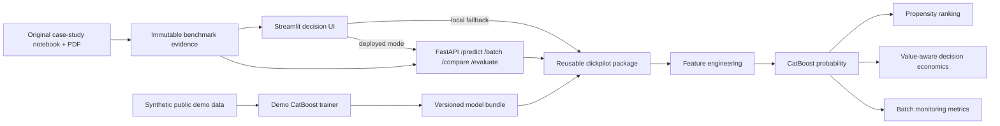

# ClickPilot AI Architecture

## Design boundary

ClickPilot AI deliberately separates two evidence layers:

1. **Original case-study benchmark** — the validated results from the supplied 463,291-impression dataset.
2. **Public demo model** — a deterministic synthetic CatBoost model that proves the frontend, API, testing, monitoring, and deployment path without publishing the source rows.

This separation is crucial. The live app must never imply that its synthetic demo metrics are the original model results.

## Runtime units

### Streamlit frontend

Human-facing decision interface. When `CLICKPILOT_API_URL` is configured, scoring/comparison/monitoring calls go through FastAPI; otherwise the app uses the shared package directly for offline QA. Features include:

- single impression scoring,
- batch ranking and downloadable CSV output,
- baseline-vs-proposed scenario comparison,
- original model evidence and ablation tables,
- synthetic monitoring demonstration.

### FastAPI backend

Programmatic interface:

- `GET /health`
- `GET /model-info`
- `GET /benchmark`
- `POST /predict`
- `POST /predict-batch`
- `POST /compare`
- `POST /evaluate`

### Shared package

The `clickpilot` package owns feature engineering, data audit, synthetic data generation, training, inference, decision economics, and monitoring metrics. UI and API do not maintain separate model logic.

## Production evolution

At larger scale, move from local joblib artifacts to a model registry, online/offline feature store, asynchronous batch jobs, structured telemetry, drift dashboards, privacy controls, experimentation infrastructure, and a React/Next.js frontend if richer UI control becomes important.
